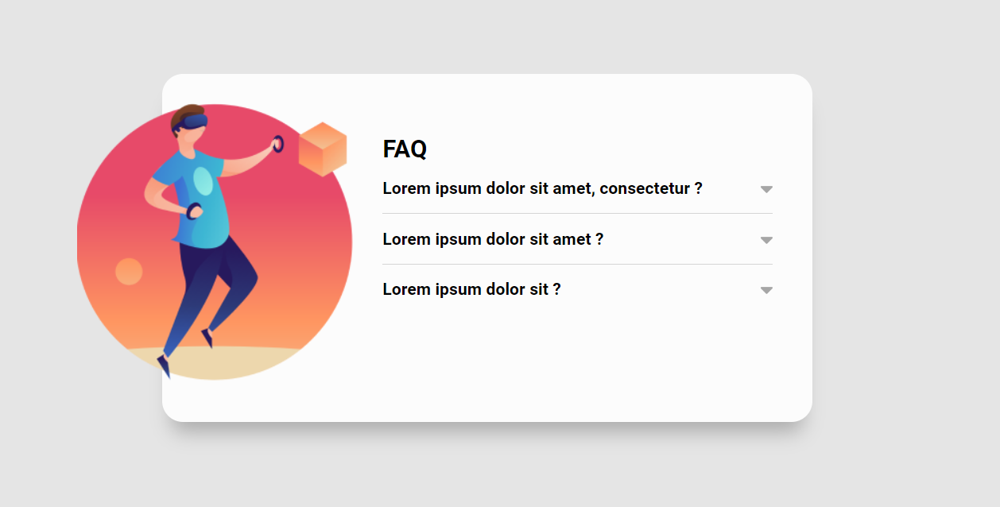
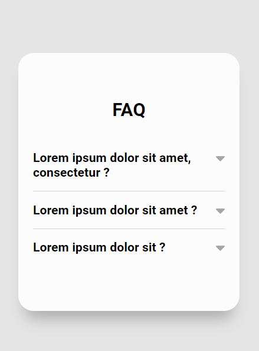

# Desafio HTML, CSS E JS INTERMEDIÁRIO - Accordion

Desafio feito durante o módulo de JS Intermediário do curso DevQuest

# Sobre o desafio

- Ao clicar em uma pergunta deve acontecer
uma animação de acordeon para abrir o item
e mostrar o texto escondido, e a seta deve
mudar de cor.
- Ao clicar em um item para abri-lo todos os
outros itens devem ser fechados.

# Tecnologias

- HTML
- CSS
- JS

# Screenshots

## Desktop

## Mobile

